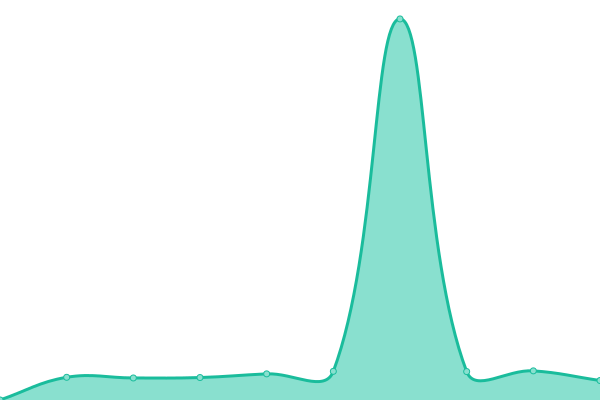
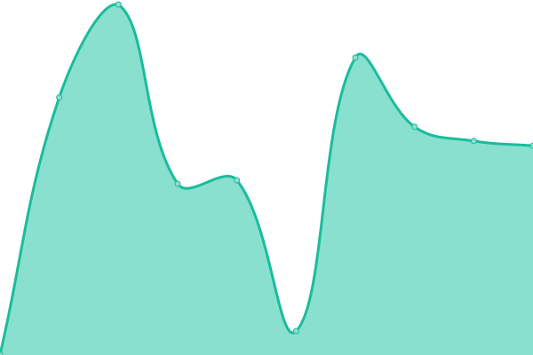

# [📈 Live Status](https://status.bitpushr.net): <!--live status--> **🟩 All systems operational**

This repository contains the open-source uptime monitor and status page for [bitpushr](https://bitpushr.net), powered by [Upptime](https://github.com/upptime/upptime).

With [Upptime](https://upptime.js.org), you can get your own unlimited and free uptime monitor and status page, powered entirely by a GitHub repository. We use [Issues](https://github.com/bitpushr/upptime/issues) as incident reports, [Actions](https://github.com/bitpushr/upptime/actions) as uptime monitors, and [Pages](https://status.bitpushr.net) for the status page.

<!--start: status pages-->
<!-- This summary is generated by Upptime (https://github.com/upptime/upptime) -->
<!-- Do not edit this manually, your changes will be overwritten -->
<!-- prettier-ignore -->
| URL | Status | History | Response Time | Uptime |
| --- | ------ | ------- | ------------- | ------ |
|  [Plex](https://plex.bitpushr.net/web/index.html#!/) | 🟩 Up | [plex.yml](https://github.com/bitpushr/upptime/commits/HEAD/history/plex.yml) | 

 959ms
     
 | 

<a href="https://bitpushr.github.io/upptime/history/plex">100.00%</a>
    

|  [Overseerr](https://overseerr.bitpushr.net/) | 🟩 Up | [overseerr.yml](https://github.com/bitpushr/upptime/commits/HEAD/history/overseerr.yml) | 

 1378ms
     
 | 

<a href="https://bitpushr.github.io/upptime/history/overseerr">100.00%</a>
    

|  [Tautulli](https://tautulli.bitpushr.net/) | 🟩 Up | [tautulli.yml](https://github.com/bitpushr/upptime/commits/HEAD/history/tautulli.yml) | 

 1539ms
     
 | 

<a href="https://bitpushr.github.io/upptime/history/tautulli">100.00%</a>
    

|  [Sonarr](https://sonarr.bitpushr.net/) | 🟩 Up | [sonarr.yml](https://github.com/bitpushr/upptime/commits/HEAD/history/sonarr.yml) | 

 1204ms
     
 | 

<a href="https://bitpushr.github.io/upptime/history/sonarr">100.00%</a>
    

|  [Radarr](https://radarr.bitpushr.net/) | 🟩 Up | [radarr.yml](https://github.com/bitpushr/upptime/commits/HEAD/history/radarr.yml) | 

 1183ms
     
 | 

<a href="https://bitpushr.github.io/upptime/history/radarr">100.00%</a>
    

<!--end: status pages-->

[**Visit our status website →**](https://bitpushr.github.io/upptime/)

## 📄 License

- Powered by: [Upptime](https://github.com/upptime/upptime)
- Code: [MIT](./LICENSE) © [Mitchell](https://bitpushr.net)
- Data in the `./history` directory: [Open Database License](https://opendatacommons.org/licenses/odbl/1-0/)
