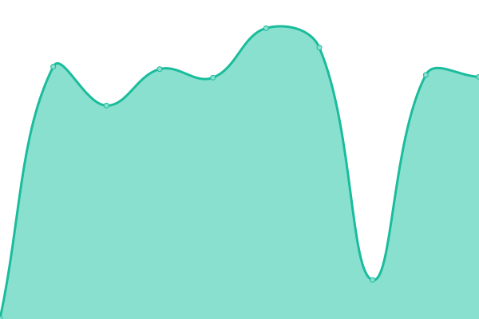

# [📈 Live Status](https://bitpushr.github.io/upptime/): <!--live status--> **🟩 All systems operational**

This repository contains the open-source uptime monitor and status page for [bitpushr](https://bitpushr.net), powered by [Upptime](https://github.com/upptime/upptime).

With [Upptime](https://upptime.js.org), you can get your own unlimited and free uptime monitor and status page, powered entirely by a GitHub repository. We use [Issues](https://github.com/bitpushr/upptime/issues) as incident reports, [Actions](https://github.com/bitpushr/upptime/actions) as uptime monitors, and [Pages](https://status.bitpushr.net) for the status page.

<!--start: status pages-->
<!-- This summary is generated by Upptime (https://github.com/upptime/upptime) -->
<!-- Do not edit this manually, your changes will be overwritten -->
<!-- prettier-ignore -->
| URL | Status | History | Response Time | Uptime |
| --- | ------ | ------- | ------------- | ------ |
|  [Plex (instance)](https://plex.bitpushr.net/web/index.html#!/) | 🟩 Up | [plex-instance.yml](https://github.com/bitpushr/upptime/commits/HEAD/history/plex-instance.yml) | 

 609ms
     
 | 

<a href="https://bitpushr.github.io/upptime/history/plex-instance">99.62%</a>
    

|  [Overseerr (instance)](https://overseerr.bitpushr.net/) | 🟩 Up | [overseerr-instance.yml](https://github.com/bitpushr/upptime/commits/HEAD/history/overseerr-instance.yml) | 

 978ms
     
 | 

<a href="https://bitpushr.github.io/upptime/history/overseerr-instance">99.62%</a>
    

|  [bitpushr.net website (VIP)](https://bitpushr.net) | 🟩 Up | [bitpushr-net-website-vip.yml](https://github.com/bitpushr/upptime/commits/HEAD/history/bitpushr-net-website-vip.yml) | 

 4961ms
     
 | 

<a href="https://bitpushr.github.io/upptime/history/bitpushr-net-website-vip">100.00%</a>
    

|  [bitpushr.net dashboard (instance)](https://dashboard.bitpushr.net) | 🟩 Up | [bitpushr-net-dashboard-instance.yml](https://github.com/bitpushr/upptime/commits/HEAD/history/bitpushr-net-dashboard-instance.yml) | 

 546ms
     
 | 

<a href="https://bitpushr.github.io/upptime/history/bitpushr-net-dashboard-instance">99.62%</a>
    

|  [bitpushr.net documentation wiki (CF)](https://docs.bitpushr.net) | 🟩 Up | [bitpushr-net-documentation-wiki-cf.yml](https://github.com/bitpushr/upptime/commits/HEAD/history/bitpushr-net-documentation-wiki-cf.yml) | 

 151ms
     
 | 

<a href="https://bitpushr.github.io/upptime/history/bitpushr-net-documentation-wiki-cf">100.00%</a>
    

<!--end: status pages-->

[**Visit our status website →**](https://bitpushr.github.io/upptime/)

## 📄 License

- Powered by: [Upptime](https://github.com/upptime/upptime)
- Code: [MIT](./LICENSE) © [bitpushr](https://github.com/bitpushr)
- Data in the `./history` directory: [Open Database License](https://opendatacommons.org/licenses/odbl/1-0/)
